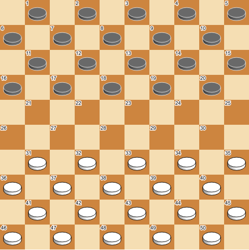
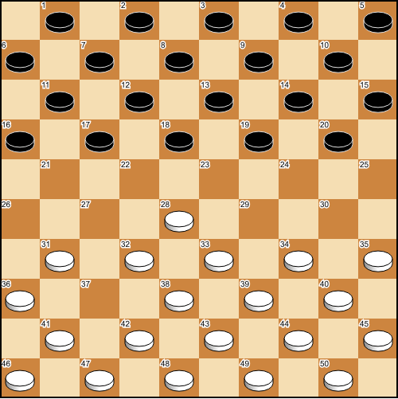
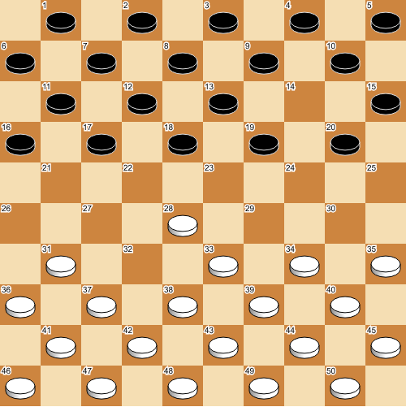

.. _commands-section:

============
PDN Commands
============

-----------------
Embedded commands
-----------------

Comments in PDN files may have embedded commands. Embedded
commands may appear anywhere inside comments, and they have the
following syntax: ``[%COMMAND VALUE]``, where ``COMMAND`` identifies
the command and ``VALUE`` is command-specific syntax.

clk, mct, egt and emt command
-----------------------------

The following commands are taken from [DGT]_:

================ =============================================
  Command          Description
================ =============================================
  clk              Time displayed on a clock (remaining time)
  mct              Time displayed on a clock (elapsed time)
  egt              Elapsed game time
  emt              Elapsed move time
================ =============================================

The values of the ``clk``, ``egt``, ``emt`` and ``mct`` commands are in ``h:mm:ss`` format.
Usually ``clk`` values come from a digital clock, while ``mct`` values come from
a mechanical clock.

**Examples**

::

  1. 31-26 {[%clk 1:55:21]}
  
clock command
-------------

The ``clock`` command is an extension of the ``clk`` command.
An embedded ``clk`` command should match with the following regular expression:

::

  \[%clock\s*(([wWbB])(\d{1,2}:\d\d:\d\d)\s*)(([wWbB])(\d{1,2}:\d\d:\d\d)\s*)?\]

**Examples**
  
::

  1. 31-26 {[%clk w0:00:10 B0:00:03]}

  23.44-39 {[%clk 1:05:23]} 18-23 {Optional leading comments
  [%clock 0:49:11] optional trailing comments} 

In cases like this the clock time is connected to the preceding move. It is
the preferred way of specifying clock times during live recordings with
electronic boards. A clock command may contain one or two clock times. Each
of them may be preceded by a ``w`` or a ``b`` to denote the clock time for
white or black. If uppercase is used, it means that the clock for this player
is running.
   
--------------
Setup commands
--------------

The PDN grammars presented in this document contain an extension for doing
setups of a position anywhere in the game. The motivation for having this
command is threefold:

- It gives a well-defined way to handle illegal moves, that happen occasionally
  in tournament practice.
- They can be used to handle move recognition failures of electronic board
  software.
- In game analysis it is common to make side steps to different positions,
  for example to a similar position that has occurred before. The setup
  command allows to incorporate these side steps as normal variations
  starting with a setup.

A setup command is a FEN setup command surrounded by forward slashes.
Note that this extension is not backward compatible with older versions
of the PDN standard. This is an intentional choice, since the moves which
appear after a setup are ill-defined if the setup is ignored. Setups are changes
on the board, and so they should be on the same level as moves. It is therefore
not a good idea to model them as embedded commands inside comments. 

**Examples**

::

  1.31-26 17-21 /FEN "B:B1-16,18-21:W26,28,33-50"/
  { White forgot to make a capture and played 32-28 instead }

Suppose White plays two moves in a row: first 32-28, then illegally 37-32.
Black then responds with 20-25. The following positions occur:

   Initial position.

   After White illegally plays two moves.

   After Black plays 20-25.

Writing ``01. 32-28 37-32`` is not valid PDN, since two consecutive moves by the same player
are not allowed. The correct approach is to use a setup command. This can be encoded using

::

   /FEN "W:W31-50:B1-20"/
   /FEN "B:W28,31-36,38-50:B1-20"/
   01... 20-25

The setup of the initial position is required here. If it was
omitted, the second setup would be taken as initial position of the game.

**Null moves**

For programmers, null moves are sometimes useful to denote an empty move.
A possible notation for a null move, proposed by Gérard Taille, is

::

  /FEN "B::"/
